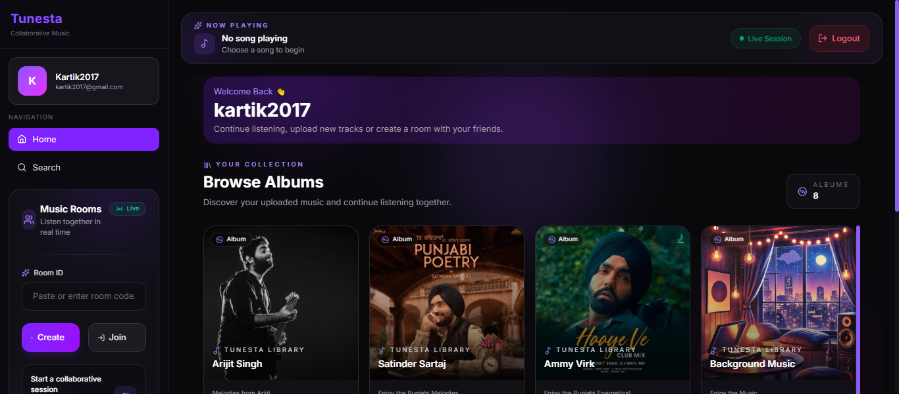
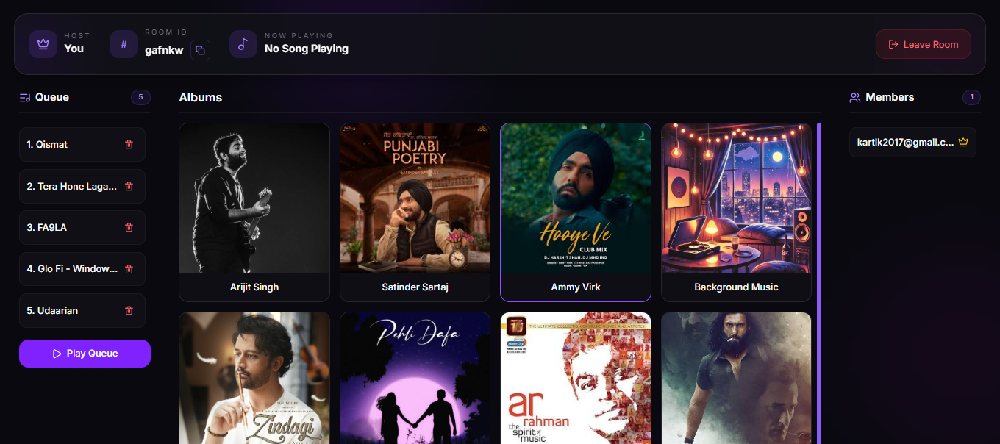

# 🎵 Tunesta

> Real-time collaborative music streaming platform where users can listen to music together inside shared rooms.


[🚀 Live Demo](https://tunesta.vercel.app)

## 📸 Preview

<p align="center">
  
  
</p>

## ✨ Features

### 🔐 Authentication
- User registration and login
- JWT-based authentication
- Password hashing with bcryptjs
- Protected API routes

### 🎵 Music
- Browse albums and songs
- Play music from albums
- Host-controlled playback
- Play / pause synchronization
- Volume control
- Automatic song progression

### 🎧 Shared Queue
- Add songs to the shared queue
- Remove songs from the queue
- Play the queue
- Prevent duplicate songs
- Prevent adding the currently playing song

### 👥 Real-Time Rooms
- Create and join music rooms
- Share rooms using a Room ID
- See connected users in real time
- Host and listener roles
- Host transfer when required
- Real-time room updates

### ⚡ Real-Time Communication
- Socket.IO-based communication
- Real-time playback events
- Real-time queue updates
- User join/leave events
- Disconnect handling

### ☁️ Media Storage
- Cloudinary-based cloud media storage

## 🏗️ Architecture

Tunesta follows a full-stack architecture where REST APIs handle persistent application data and Socket.IO handles real-time communication.

```text
                         ┌─────────────────────┐
                         │    React + Vite     │
                         │      Frontend       │
                         └──────────┬──────────┘
                                    │
                       ┌────────────┴────────────┐
                       │                         │
                    REST API                 Socket.IO
                       │                         │
                       ▼                         ▼
                ┌──────────────────────────────────┐
                │        Node.js + Express         │
                │                                  │
                │  Authentication                  │
                │  Room Management                 │
                │  Music Management                │
                │  Queue Management                │
                │  Socket.IO Server                │
                └──────────────┬───────────┬───────┘
                               │           │
                               ▼           ▼
                       ┌────────────┐ ┌────────────┐
                       │  MongoDB   │ │ Cloudinary │
                       │   Atlas    │ │            │
                       └────────────┘ └────────────┘
```

## ⚡ Real-Time Architecture

Tunesta uses **Socket.IO** to synchronize music room state between connected users in real time.

The host controls playback, and Socket.IO broadcasts the corresponding events to other users in the room.

```text
Host
 │
 │ Play / Pause / Next
 ▼
Socket.IO Server
 │
 ├──────────────► User 1
 │
 ├──────────────► User 2
 │
 └──────────────► User 3
```

## 🛠️ Tech Stack

| Layer | Technology |
|---|---|
| Frontend | React, Vite |
| Backend | Node.js, Express.js |
| Database | MongoDB Atlas, Mongoose |
| Real-Time Communication | Socket.IO |
| Authentication | JWT, bcryptjs |
| Media Storage | Cloudinary |
| Frontend Deployment | Vercel |
| Backend Deployment | Render |
| Version Control | Git, GitHub |

## 🧠 Engineering Challenges & Solutions

### 🔄 Real-Time Playback Synchronization

Synchronizing playback between multiple users was one of the main challenges.

When the host plays, pauses, or skips a song, the action is sent through Socket.IO and broadcast to the other users connected to the room.

This allows all users to receive the same playback events in real time.

### 🎵 Queue Synchronization

The shared queue needed to remain consistent across all users in the room.

Queue actions such as adding, removing, and playing the next song are handled through Socket.IO so that connected users receive the same queue updates.

Additional checks were implemented to prevent duplicate songs and avoid adding the currently playing song to the queue.

### 👥 Handling Duplicate Users

Refreshing a room creates a new Socket.IO connection, which can otherwise cause the same user to appear multiple times.

The room management logic tracks users using their user identity and socket connection, allowing duplicate connections to be handled correctly.

### 👑 Host Management

The room needs a valid host to control playback.

When the current host leaves or disconnects, the server handles host transfer so that another connected user can take over the host role.

### 🔌 Disconnect Handling

Users can leave normally or disconnect unexpectedly by closing the browser or losing their connection.

Socket.IO disconnect handling removes disconnected users from the room and updates the remaining clients in real time.

This keeps the room state consistent as users join, leave, refresh, or disconnect.

## 🌍 Deployment

| Service | Platform |
|---|---|
| Frontend | Vercel |
| Backend | Render |
| Database | MongoDB Atlas |
| Media Storage | Cloudinary |

### Live Application

**Frontend:** https://tunesta.vercel.app

**Backend:** https://tunesta-backend.onrender.com

## 🔮 Future Improvements

- 💬 Real-time room chat
- 📱 Improved mobile responsiveness
- 🎵 Playlist support
- 🔄 More accurate playback position synchronization
- 🎶 Advanced queue management
- 🔐 More granular room permissions
- 📊 Better monitoring and error handling

## 👨‍💻 Author

**Kartik Jain**

[GitHub](https://github.com/kartik764)